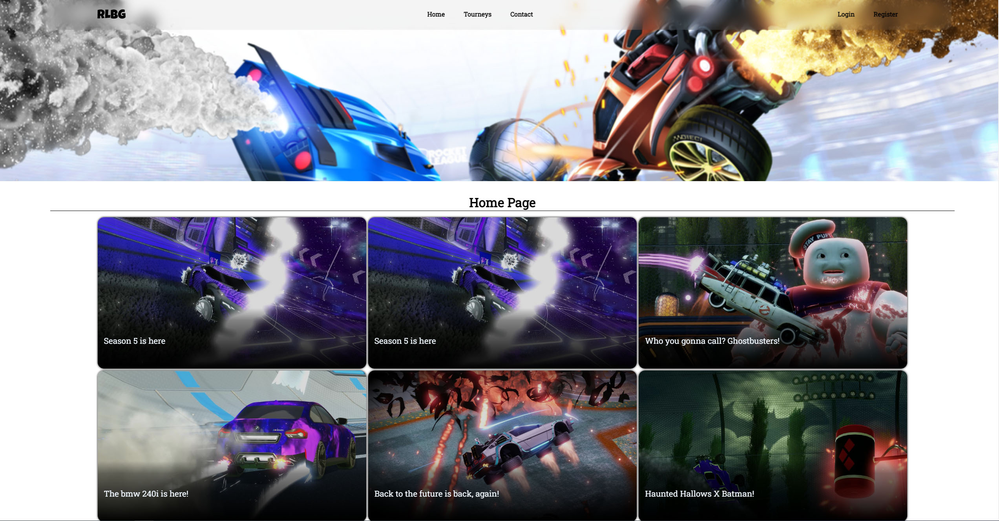

# Custom Carousel

## Usage/Examples

### Example #1
```html
<head>
  ...
  <script src="carousel.js"></script>
</head>
<body>
  <div class="carousel" id="carousel">
        <div class="carousel_container">
            <ul class="carousel_track">
                <li class="carousel_slide current_slide">
                    
                </li>
                <li class="carousel_slide">
                    
                </li>
                <li class="carousel_slide">
                    
                </li>
                <li class="carousel_slide">
                    
                </li>
            </ul>
        </div>

        <button class="carousel_button carousel_button-left"><</button>

        <button class="carousel_button carousel_button-right">></button>

        <div class="carousel_nav"></div>
    </div>
    
    <script>
        const carousel = new Carousel({
            selector: '#carousel',
            transitionSpeed: 300,
            draggable: true,
            dragSens: 1.5,
            snapOnDrag: true,
            loop: true,
            perPage: 1,
            autoScroll: 5
        })
    </script>
</body>
```

### Example #2
```html
<head>
  ...
  <script src="carousel.js"></script>
</head>
<body>
  <div class="carousel hero-carousel" id="heroCarousel">
      <div class="carousel_container">
          <ul class="carousel_track">
              <li class="carousel_slide current_slide">
                  <div class="wrapper">
                      <div class="content-container">
                          <h1>PS5 accessories</h1>
                          <p>Check out our new playstation 5 controllers and VR sets</p>
                          <button data-text="See offers" class="btn-primary btn-big">See offers</button>
                      </div>
                      <div class="image-container">
                          
                      </div>
                  </div>
              </li>
              <li class="carousel_slide">
                  <div class="wrapper">
                      <div class="content-container">
                          <h1>PS5 accessories</h1>
                          <p>Check out our new playstation 5 controllers and VR sets</p>
                          <button data-text="See offers" class="btn-primary btn-big">See offers</button>
                      </div>
                      <div class="image-container">
                          
                      </div>
                  </div>
              </li>
              <li class="carousel_slide">
                  <div class="wrapper">
                      <div class="content-container">
                          <h1>PS5 accessories</h1>
                          <p>Check out our new playstation 5 controllers and VR sets</p>
                          <button data-text="See offers" class="btn-primary btn-big">See offers</button>
                      </div>
                      <div class="image-container">
                          
                      </div>
                  </div>
              </li>
          </ul>

          <div class="loading-bar"></div>
      </div>
  </div>
  <script>
      const heroCarousel = new Carousel({
          selector: '#heroCarousel',
          transitionSpeed: 300,
          draggable: true,
          dragSens: 1.5,
          loop: true,
          perPage: 1,
          autoScroll: 10
      });
  </script>
</body>
```

### Example #3
```html
<head>
  ...
  <script src="carousel.js"></script>
</head>
<body>
    <div class="carousel random-carousel" id="randomCarousel">
        <div class="carousel_container">
            <ul class="carousel_track">
                <li class="carousel_slide">
                    <a href="#iphone-xs">
                        <div class="wrapper">
                            <div class="product-image">
                                
                            </div>
                            <span class="product-name">iPhone XS</span>
                            <span class="stars product-rating">
                                <span class="yellow">★★★★</span>★
                            </span>
                        </div>
                    </a>
                </li>
                <li class="carousel_slide">
                    <a href="#ps4">
                        <div class="wrapper">
                            <div class="product-image">
                                
                            </div>
                            <span class="product-name">Playstation 4</span>
                            <span class="stars product-rating">
                                <span class="yellow">★★</span>★★★
                            </span>
                        </div>
                    </a>
                </li>
                <li class="carousel_slide">
                    <a href="#sony_dualsense_ps5_01_blanco_l">
                        <div class="wrapper">
                            <div class="product-image">
                                
                            </div>
                            <span class="product-name">Sony Dualsense PS5 Controller</span>
                            <span class="stars product-rating">
                                <span class="yellow">★★★★</span>★
                            </span>
                        </div>
                    </a>
                </li>
                <li class="carousel_slide">
                    <a href="#spiderman_ps4">
                        <div class="wrapper">
                            <div class="product-image">
                                
                            </div>
                            <span class="product-name">Spiderman PS4</span>
                            <span class="stars product-rating">
                                <span class="yellow">★★★</span>★★
                            </span>
                        </div>
                    </a>
                </li>
                <li class="carousel_slide">
                    <a href="#keyboard">
                        <div class="wrapper">
                            <div class="product-image">
                                
                            </div>
                            <span class="product-name">Keyboard</span>
                            <span class="stars product-rating">
                                <span class="yellow">★★★</span>★★
                            </span>
                        </div>
                    </a>
                </li>
            </ul>
        </div>

        <div class="carousel-label">
            Random Products
        </div>
    </div>
    <script>
        const randomCarousel = new Carousel({
            selector: '#randomCarousel',
            transitionSpeed: 300,
            draggable: true,
            dragSens: 1.5,
            snapOnDrag: false,
            loop: true,
            perPage: [
                { maxwidth: 1080, items: 4 },
                { maxwidth: 700, items: 3 },
                { maxwidth: 400, items: 2 },
                { maxwidth: 300, items: 1 }
            ],
            autoScroll: 0
        });
    </script>
</body>
```

## Screenshots


